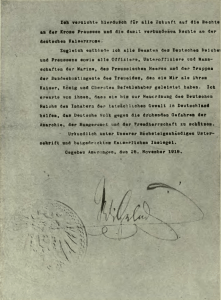

<figure><figcaption>Kaiser Wilhelm II. in Exile <em>Source: <a href="https://de.wikipedia.org/wiki/Datei:Bundesarchiv_Bild_136-C0804,_Kaiser_Wilhelm_II._im_Exil.jpg" target="_blank" rel="noreferrer noopener">Wikipedia</a></em></figcaption></figure>

It is well-known that Germany’s Kaiser Wilhelm II abdicated after the end of the First World War, but that is generally when he exits the stage of popular history. Other than those that have a particular interest in the topic of what happened to him and what he did after his abdication and subsequent escape to the Netherlands, not many people know much about the intervening years until his death in 1941. So what happened to him? What did he do in that time? This article aims to explore some of these questions. 

Abdication
----------

Kaiser Wilhelm II abdicated in November 1918 at the end of the First World War bringing an end both to centuries of Hohenzollern rule in Prussia as well as to the forty-seven year-old German Empire. 

In late 1918, uprisings in Berlin and other cities throughout the empire as well as mutiny within the German Imperial Navy took him and his government by surprise. [The German Revolution of 1918-1919](https://en.wikipedia.org/wiki/German_Revolution_of_1918%E2%80%931919) had begun. 

<figure><figcaption>Abdication Statement of Wilhelm II <em>Source: <a href="https://en.wikipedia.org/wiki/File:NotaDeAbdicaci%C3%B3nDelKaiser1918.png" target="_blank" rel="noreferrer noopener">Wikipedia</a></em></figcaption></figure>

As news of these occurrences reached the Kaiser, he was at the Imperial Army headquarters in Spa, Belgium. His first reaction was to reject any notion of his abdication, but as the situation started to spiral out of control, he tried to find a way to abdicate the imperial crown while still retaining the Prussian crown. However, since both crowns were linked in the constitution there was no way to give up one without the other. 

On November 9, 1918, the German chancellor, [Prince Max von Baden](https://en.wikipedia.org/wiki/Prince_Maximilian_of_Baden), announced Wilhelm’s abdication. No agreement had been made yet with Wilhelm who was still trying to figure out a way to hold onto at least one of his thrones. The announcement, however, forced Wilhelm’s hand and on November 28, he signed the abdication statement formalizing it. 

> Statement of Abdication. I herewith renounce for all time claims to the throne of Prussia and to the German Imperial throne connected therewith. At the same time I release all officials of the German Empire and of Prussia, as well as all officers, non-commissioned officers and men of the navy and of the Prussian army, as well as the troops of the federated states of Germany, from the oath of fidelity which they tendered to me as their Emperor, King and Commander-in-Chief. I expect of them that until the re-establishment of order in the German Empire they shall render assistance to those in actual power in Germany, in protecting the German people from the threatening dangers of anarchy, famine, and foreign rule. Proclaimed under our own hand and with the imperial seal attached. Amerongen, 28 November 1918. Signed WILLIAM.
> 
> *Source: [Wikipedia](https://en.wikipedia.org/wiki/Abdication_of_Wilhelm_II#%22Statement_of_Abdication%22)*

He was never to set foot in Germany again.

Escape and Exile
----------------

On November 10, 1918, Wilhelm rode the train into exile in the Netherlands which had remained neutral throughout the war. The Dutch queen, [Wilhelmina](https://en.wikipedia.org/wiki/Wilhelmina_of_the_Netherlands), and her government granted him political asylum owing partially to the good relationship the two monarchs had maintained throughout the years.

After the signing of the [Treaty of Versailles](https://en.wikipedia.org/wiki/Treaty_of_Versailles) in early 1919, the Allies formally requested the Kaiser’s extradition so that he may face justice for the war. This was, however, mostly just a political gesture and there was little enthusiasm on the part of the United States and Great Britain. The Netherlands politely refused and the matter was dropped.

Wilhelm first settled at a [small castle in Amerongen](https://en.wikipedia.org/wiki/Amerongen_Castle). It was here that he signed the abdication statement. This was only a temporary arrangement, however, before he purchased [Huis Doorn](https://en.wikipedia.org/wiki/Huis_Doorn) in 1919 for 500,000 guilders.

Where He Settled Down
---------------------

<figure><figcaption>Huis Doorn in 1925 <em>Source: <a href="https://commons.wikimedia.org/wiki/File:Bundesarchiv_Bild_102-01060A,_Niederlande,_Schloss_Doorn.jpg" target="_blank" rel="noreferrer noopener">Wikipedia</a></em></figcaption></figure>

Originally built in the ninth century and rebuilt in both the fourteenth and nineteenth centuries, Huis Doorn is a large manor house located in the town of Doorn near the city of Utrecht. The house sits on extensive grounds whose gardens were created in the nineteenth century. Its location in the middle of the grounds makes it a safe, quiet refuge — perfect for the dethroned Kaiser.

Being a refugee made it difficult for Wilhelm to collect any of his belongings from his various residences throughout Germany. However, the newly established government of the [Weimar Republic](https://en.wikipedia.org/wiki/Weimar_Republic) allowed him to have twenty-three railway wagons of furniture as well as twenty-seven wagons of other various possessions, including a car and a boat, moved to Doorn from the [New Palace](https://en.wikipedia.org/wiki/New_Palace_\(Potsdam\)) at Potsdam near Berlin.

The Dutch government allowed him to move freely within a fifteen-kilometer radius of his property, but any trips further than that had to be reported to the local authorities. He rarely traveled any further as he did not like having to submit to what was in his option such lowly government officials.

A map of Huis Doorn and its surroundings:

What He Did With His Time
-------------------------

The ex-Kaiser spent a lot of his time tending to his ducks, his dogs, his garden and going on walks throughout the grounds of Huis Doorn. He became infamous for his woodchopping habits as he spent a lot of his time chopping down trees on the property, then cutting them up into pieces of firewood and stacking them. In fact, some of his enemies gave him the nickname “The Woodchopper of Doorn”.

He also entertained a number of guests — including several prominent people, learned the Dutch language, sketched plans for grand buildings and battleships and was an avid hunter. As he aged, he replaced his world-famous W-shaped moustache with a more subtle one and let his beard grow, changing his appearance significantly.

When he grew restless, Wilhelm would go “motoring”. A driver would take him and whoever he invited to come with him for a drive within the fifteen-kilometer radius limit of Huis Doorn. For these occasions, he would even don the military-looking cap of the old Imperial Automobile Club he headed in Berlin.

In 1922, Wilhelm published the first volume of his memoirs, [*Ereignisse und Gestalten 1878-1918*](https://books.google.de/books?id=37h0CgAAQBAJ&printsec=frontcover&dq=Ereignisse+und+Gestalten+1878-1918&hl=en&sa=X&ved=0ahUKEwiNvb_19LrpAhXF4KYKHYwcDioQ6AEIJzAA#v=onepage&q=Ereignisse%20und%20Gestalten%201878-1918&f=false) (English title: [*The Kaiser’s Memoirs*](https://www.gutenberg.org/files/43522/43522-h/43522-h.htm)), in which he claimed he was not guilty of initiating the First World War and defended his conduct and policy-making throughout his thirty-year reign.

The Imperial Family, Nazism and More
------------------------------------

Part 2 of this article goes into more detail about Wilhelm’s family in exile, attempts to restore the monarchy, the rise of Hitler and the Nazis as well as his death and burial.

Please check back or subscribe by email or [RSS](https://www.historyrhymes.info/feed/) to be notified when Part 2 is published.