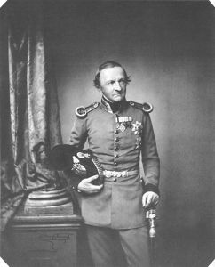

King Ludwig I of Bavaria  
*Source: [Wikipedia](http://commons.wikimedia.org/wiki/File:LouisI.jpg)*

King Ludwig I was the second king of Bavaria. Although, like his father, [King Maximilian I Joseph](https://www.historyrhymes.info/2013/01/26/kings-of-bavaria-king-maximilian-i-joseph/), he was born outside of Bavaria before the establishment of the Bavarian kingdom, his legacy is still felt to this day with no place being as strongly impacted as his capital city, Munich.

Ludwig Karl August was born on August 25, 1786 in Strasbourg in modern-day France to Maximilian I. Joseph and Princess Auguste Wilhelmine Maria von Hessen-Darmstadt. His godfather was King Louis XVI of France and his birth coincided with the death of Prussian King Frederick the Great who had died just five days before. He was the uncle of the famous Austrian Empress, Elisabeth, known primarily by her nickname “Sisi”.

As a young man, he was very studious. He attended the University of Landshut where he studied under Theologist Johann Michael Sailer and the final years of his education were spent at the University of Göttingen. At both universities, he focused on Ancient History as well as French, Spanish and Italian literature. Later, he added Russian to his repertoire of languages.

On October 12, 1810, he married Princess Therese von Sachsen-Hildburghausen. Ludwig celebrated the wedding publicly in Munich with a celebration that became the Munich tradition of *Oktoberfest*. The field where Oktoberfest takes place in Munich every year was named after Ludwig’s wife, *Theresienwiese*.

As Crown Prince, Ludwig became more involved in the day-to-day politics of his father’s government. He attended the [Congress of Vienna](https://www.historyrhymes.info/2010/03/27/nineteenth-century-german-history-consequences-of-the-fall-of-the-holy-roman-empire-1806-1848-part-2/) where he advocated a pro-German nation stance and, in 1817, he even took part in the rising opposition to his father’s prime minister, Maximilian Graf von Montgelas, which led to the prime minister’s dismissal on February 2, 1817.

In 1821, the Greek War of Independence (1821-1832) broke out. His official support for the eventually successful revolutionaries and a loan of 1.5 million guilders given to them from his personal fortune led to his second son, Otto, being crowned King of Greece in May, 1832 in London.

Ludwig became King of Bavaria upon his father’s death on October 13, 1825. He received the title “King of Bavaria” which he changed to “King of Bavaria, Duke of Franconia, Duke in Swabia and Count Palatine of the Rhine” (“*König von Bayern, Herzog von Franken, Herzog in Schwaben und Pfalzgraf bei Rhein*“) in 1837. The new titles were a revival of the titles his family, the Wittelsbachers, had held in the Middle Ages and were largely symbolic. All of his successors carried these titles as well.

At the opening of his reign, King Ludwig’s policies were overwhelmingly liberal. Just a month and a half after his ascension to the throne, he lifted the censorship of the press and gave them more freedom — a feat none of his predecessors would have dreamed about doing. In 1826, he had the Ludwig-Maximilian University moved from Landshut to its current home in Munich. He was also a strong supporter of the arts and of Bavarian culture. Throughout his reign, he worked to reverse [his father’s secularization policies](https://www.historyrhymes.info/2013/01/26/kings-of-bavaria-king-maximilian-i-joseph/) by re-erecting monasteries and returning confiscated property to the Church.

Former King Ludwig I ca. 1860  
*Source: [Wikipedia](http://commons.wikimedia.org/wiki/File:Ludwig_I.,_König_von_Bayern_Arround_1860.jpg)*

With the July Revolution of 1830 in Paris, France, Ludwig’s fortunes and popularity began to wane — albeit primarily from his own doing. He reintroduced censorship of the press which he had abolished just five years previously and his reign became altogether more repressive. In March 1844, the Beer Riots broke out in Munich in protest to the increased price in bread and, as a result, of beer.

More fatally, however, was his extramarital affair with Irish dancer Lola Montez which started in 1846. Although he had had many affairs, the intensity of this one caused public outrage. He visited her almost every day and even ennobled her with the title of Duchess of Landsfeld (“*Gräfin von Landsfeld*“). The affair led to protests at the Ludwig-Maximilian University which the King then ordered shuttered. More riots were the result which forced Ludwig to eventually reopen the university and expel Montez from Munich.

On March 4, 1848, in coincidence with other riots in German-speaking lands, a large crowd stormed the Munich Residence with weapons stolen from the King’s armory. Ludwig’s brother, Prince Karl, was able to diffuse the situation, but the Royal Family as well as the King’s Cabinet turned against him. They forced him the sign the “March Proclamation” with substantial concessions.

Lola Montez returned to Munich on March 16, 1848 despite her expulsion and a day later, the King was forced the endure the humiliation of allowing her to be searched by police. On March 20, 1848, King Ludwig I abdicated in favor of his oldest son, Maximilian II. He claimed he was not willing to rule under these conditions anymore.

Ludwig lived another twenty years as an abdicated monarch. He spent his time continuing to support and enjoy the arts from his private fortune and was still very influential. He died on February 29, 1868 at the age of 81 years old in Nice. He is buried in St. Boniface’s Abbey in Munich which he had had built.

This post is part of a multi-part series about the kings of Bavaria. See the rest of the series either on the [Kings of Bavaria project page](https://www.historyrhymes.info/featured/kings-of-bavaria/) or in [the category of the same name](https://www.historyrhymes.info/category/multi-part-series/kings-of-bavaria/).