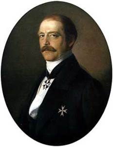
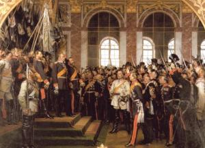

A fresco created by Philipp Veit to represent German unification.  
*Source: [Wikipedia](http://en.wikipedia.org/wiki/File:Philipp_Veit_008.jpg)*

By midcentury a fairly clear picture was beginning to emerge that unification of the German states was going to be inevitable in one form or another. One of the largest and more pressing hurdles yet to overcome, however, was which state was going to dominate and lead this unified Germany. The key players in this situation were German-speaking Austria and Prussia. Eventually this pressure led to war between the two countries, out of which emerged a political figure whose influence on the soon to be united Germany was almost greater than the *Kaiser’s*. This man was Otto von Bismarck.

Born of noble birth in Prussia and destined for politics, Bismarck began his political career in relative obscurity, but rose through the ranks at a rapid pace. During the Revolution of 1848, he founded a conservative political party called the *Kreuzzeitungspartei* which he used as a springboard to launch his political ambitions. Only three years later, in 1851, he was made the Prussian ambassador to the German *Bundestag* in Frankfurt. He served this position until 1859 when he was made ambassador to Russia at St. Petersburg and, for a short time in 1862, ambassador to France.40 1862 proved to be a pivotal year for both Bismarck’s career and for Germany itself.

Otto von Bismarck as Prime Minister.  
*Source: [Wikipedia](http://en.wikipedia.org/wiki/File:Otto%2Bvon%2Bbismarck.jpg)*

In the midst of a crisis41 which the Prussian king, Wilhelm I, had gotten himself into with the Prussian parliament (*Abgeordnetenhaus*) during an attempted army reform, Bismarck was recalled by the king to help him resolve it. To most effectively fulfill this new duty, he was appointed Prime Minister and Foreign Minister in September, 1862.42 His first act as Prime Minister was to “\[concoct\] a modified military reform programme that would enlarge the army and secure government control in key areas while meeting the liberal demand for two-year service” and thereby resolve the King’s crisis.43 The primary issue that was a stake in the crisis was which power had the right to control the government’s finances. The parliament claimed the right to be able to finance the King’s reform which the King views as an attack on the traditional powers of the Crown.44 Bismarck openly sided with the King by defying the parliament in order to assure the King he was dedicated to the crown and to assure his office. He therefore passed the army reform through while collecting taxes without the consent of parliament.45 If Bismarck’s position was not already secure enough, his military victories would ensure that he remained in a powerful position in the Prussian government.

During times of war, Bismarck proved himself a very capable leader which had wonderful ramifications for Prussia. The second German-Danish War of 1864 allowed Bismarck to secure his position as a favorable politician to the King because he demonstrated capable leadership by controlling vast portions of the German affairs during the war.46 The Austro-Prussian War of 1866 was yet another example of his ability to lead in war.

North German Confederation (in red).  
*Source: [Wikipedia](http://en.wikipedia.org/wiki/File:Map-NDB.svg)*

War between the two major powers in German-speaking Europe was almost unavoidable. Both Prussia and Austria wanted power over what was seen as the coming unification of Germany. Austria did not want Prussian dominance because they wanted power and the Germans were generally wary of having another Habsburg dynasty because of the failures of the first one which had ruled the Holy Roman Empire for centuries.47 On June 9, 1866, Prussia invaded Austria. The war only lasted seven weeks with the Austrian Emperor Franz Joseph capitulating to the Prussians on July 22, 1866. On July 26, the Peace of Nikolsburg officially ended the war and a month later on August 23, the Treaty of Prague was signed.48 The repercussions of this treaty were significant. It allowed Austria to keep all of its territorial possessions except Venetia, but it did force Austria to recognize the annexation of Hanover, Nassua, Hesse-Kassel, Schleswig, Holstein, and Frankfurt by Prussia.49 Perhaps more importantly, however, was the establishment of the North German Confederation (*Norddeutscher Bund*) with Prussia as its head. This served as the foundation for what later became the new German Empire, however, there was yet another obstacle to overcome before the Empire could be established. This was France under the Emperor Napoleon III.

Before it was possible to establish a new German Empire under Prussian leadership, Bismarck needed to get rid of the threat which France would pose should Germany be unified.50 He believe Prussia could engage France in a war and win, however, this was not a very popular opinion and would put his political position at stake which he was no willing to do. Instead, he looked for a way to induce the French to attack Prussia. This lucky break came in 1870 when a relative of the King Wilhelm’s, Leopold, ascended the Spanish throne. Napoleon III felt surrounded and as such sent an ambassador to King Wilhelm to convince him to withdraw his support from the new Spanish king. Reluctantly, Wilhelm complied, but was not willing to comply to other demands made by the French.51 In a telegram, which would later be known as the EMS Telegram, the King explained to Bismarck what had taken place in the meeting between himself and the French ambassador. Bismarck saw his opportunity. He leaked a slightly edited version of the telegram to the German press and also conveniently leaked a French translation of it.52 His trap worked. Napoleon, enraged by this, mobilized troops to go to war and, on July 19, 1870, declared war on Prussia. The war resulted in a major defeat for France. On September 2, 1870, France surrendered and Napoleon III was taken into Prussian custody. France was plunged yet again into chaos and the French threat against German unification was eradicated.

Proclamation of the German Empire January 18, 1871.  
*Source: [Wikipedia](http://en.wikipedia.org/wiki/File:Reichsgründung1871-AW.jpg)*

Prussia was now free to establish its long sought after empire and did so with the utmost vigilance. On January 18, 1871, the new German Empire (*Deutsches Kaiserreich*) was officially proclaimed when Prussian king Wilhelm I was crowned Emperor (*Kaiser*) in the Hall of Mirrors in the Palace of Versailles. The new empire was composed of the German territories of the North German Confederation, Bavaria, Baden, Hesse and Wurttemberg as well as the newly acquired French territories of Alsace and Lorraine.53 Bismarck was the first chancellor of the new empire and Wilhelm the first emperor. An imperial constitution (*Reichsverfassung*) was established on April 16, 1871 which did a number of important things. It delegated the power to set and raise taxes to the member states of the empire, it required that all member states concede equal rights to all citizens from other member states and it setup the Federal Council (*Bundesrat*) in Berlin with representatives from all member states.54 The constitution was, however, really only a formality. In reality, Prussia dominated everything because of its strong military stance which the other state could not match.55 Bismarck dominated the political scene while the *Kaiser* continued to be mostly inactive.

The German Empire.  
*Source: [Wikipedia](http://en.wikipedia.org/wiki/File:German_Reich1.png)*

The weak position of the Kaiser did, however, change upon the death of Wilhelm I. In March 1888, Wilhelm I died, leaving a legacy that was mostly that of Bismarck’s work. His son, Friederich III, ascended the imperial throne, but was already dying of throat cancer.56 He ruled for a total of ninety-nine days before succumbing to his illness in June of the same year. Upon his death, his son, Wilhelm II, became German *Kaiser* and King of Prussia. Unlike his predecessors, Wilhlem II was interested in taking the leading role of his empire and was not just content to sit back and let someone else do the work for them. His goal was to establish a vast German empire with authoritarian rule.57 In order to do this, he wanted a ‘puppet’ chancellor who would act more as a figurehead than exercise any real power.58 Bismarck, who had been so active previously, was not the man for the job under the new emperor. In 1890, he handed his resignation to the *Kaiser*, leaving Wilhelm II with a free hand to do as he pleased. One of Wilhelm’s primary focuses was building the German military and ‘playing catch-up’ with the other European powers. He wanted to establish a great military with a strong navy which would challenge Britain’s dominance in the waters. Colonies were also necessary in his option as France and Britain both had several overseas colonies in Asia and Africa while Germany still had none.59 This idea of an expansion of militarism and imperialism in the German imperial state was to have drastic consequences in the beginning of the twentieth century.

Kaiser Wilhelm II in 1905.  
*Source: [Wikipedia](http://en.wikipedia.org/wiki/File:Wilhelm_II._1905.jpeg)*

Wilhelm’s ambitious goals of establishing a large and powerful German empire through the use of a strong military was arguably one of the key factors which led to the First World War and ultimately to the destruction of the German Empire. When Austrian Archduke Franz Ferdinand was assassinated in Serbia in June 1914, the *Kaiser* viewed this as an opportunity to expand his empire through ‘legitimate’ war.60 War broke out a month later and finally came to an end with an armistice on November 11, 1918. Calls for the *Kaiser* to abdicate by the German people began when it was apparent that Germany would be defeated. On November 9, 1918, Wilhelm decided to abdicate the imperial throne, but not the Prussian throne. This idea, however, was knocked down when his chancellor, Max von Baden, announced to the public that the *Kaiser* had already abdicated both thrones. The public’s jubilant reaction forced Wilhelm to sign a statement of abdication of both thrones on November 28, 1918.61 Germany being too dangerous now for the Emperor to stay, he took his family and entourage and fled to the Netherlands where he lived the remainder of his life never to set foot in Germany again.

Wilhelm’s abdication was ultimately the fall of the German Empire which had lasted only forty-seven years. Under the reign of his grandfather, Wilhelm I, Prussia became the dominate power in the German-speaking world and a major power in European politics. The original goal was to reestablish the Holy Roman Empire which had collapsed earlier in the nineteenth century, however, Wilhelm II’s recklessness in the First World War defeated that dream.

The last part of the series is the [conclusion](https://www.historyrhymes.info/2010/04/18/nineteenth-century-german-history-conclusion/).

This entry is part of a multi-part series. You can find all of the entries either on the [Nineteenth Century German History project page](https://www.historyrhymes.info/featured/nineteenth-century-german-history/) or in [the category of the same name](https://www.historyrhymes.info/category/multi-part-series/nineteenth-century-german-history/).

* * *

40 Müller, 175.

41 The *Preußischer Verfassungskonflikt*. See Nipperdey, 749.

42 Müller, 174.

43 Christopher Clark, *The Rise and Downfall of Prussia, 1600-1947* (Cambridge, Massachusetts: Harvard University Press, 2006), 522.

44 Müller, 174.

45 Clark, 522.

46 Clark, 528-529.

47 Criswell, 592.

48 Criswell, 592.

49 Criswell, 592.

50 Criswell, 593.

51 Clark, 549.

52 Clark, 549.

53 Criswell, 594.

54 Clark, 557.

55 Clark, 558.

56 Clark, 585.

57 Criswell, 594.

58 Criswell, 594.

59 Clark, 594-595.

60 Criswell, 595.

61 Clark, 613.