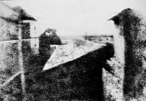

Today I was killing time by browsing [Wikipedia](http://en.wikipedia.org/wiki/File:View_from_the_Window_at_Le_Gras,_Joseph_Nicéphore_Niépce.jpg) and ran across a very interesting photograph. It is a photograph taken by Joseph Nicéphore Niépce in 1826 and is considered to be the first permanent photograph ever taken. Although difficult to make out, it is a photograph of buildings taken from a window in his apartment.

One of the more interesting aspects of it in my opinion is that the photograph required an eight hour exposure during daylight which means if you look closely, you can see that the buildings are illuminated from both the east and the west sides. I also find it quite fascinating that this photograph was taken almost 200 years ago and is, in some respects, a quick and simple glance into that time period.

Here is the photo:

View from the Window at Le Gras - The first permanent photograph taken by Joseph Nicéphore Niépce in 1826.